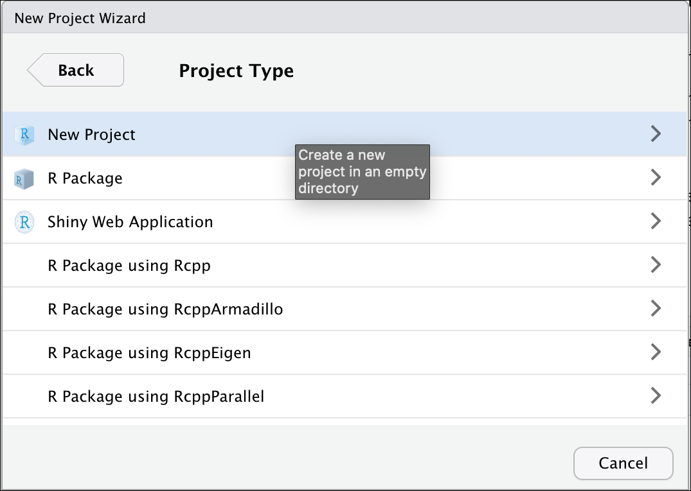
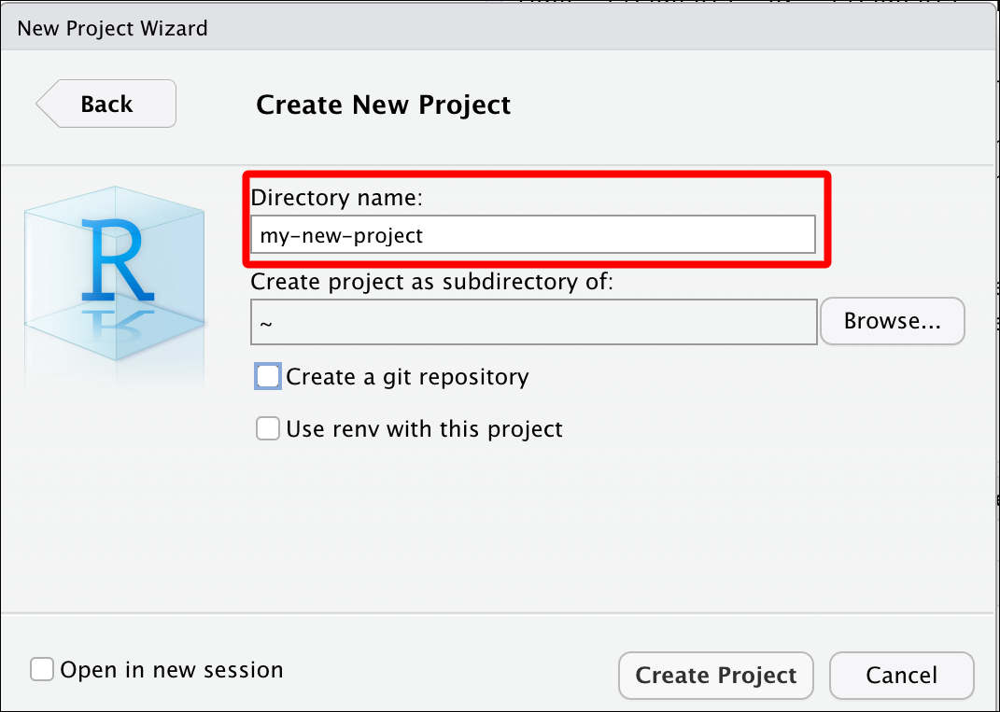

```{r setup, include=FALSE}
library(tidyverse)
library(reprex)
library(xaringan)
library(pagedown)
library(xaringanthemer)
knitr::opts_chunk$set(warning = FALSE, 
                      message = FALSE, 
                      fig.align = "center", 
                      dpi = 320, 
                      fig.height = 4)

```

```{r xaringan-themer, include=FALSE, warning=FALSE}
xaringanthemer::style_duo_accent(primary_color = "#035AA6", secondary_color = "#03A696")
# xaringan::inf_mr() # for instant knitting and reviewing
```

class: center, middle

# R Workflow Best Practices

### Managing your code, data, and files with RStudio

---
class: left, top

## Change RStudio's Default Settings 

.pull-left[

#### Click on **Tools** > **Global Options...**

#### - We want to uncheck "*Restore .RData into work space at start up*"  

#### - We also want to make sure we change "*Save work space to .Rdata on exit*" to "*Never*"

]

.pull-right[

```{r img-settings, echo=FALSE, out.width='200%', out.height='200%', fig.align='center'}
knitr::include_graphics(path = "img/settings.png")
```


]

---
class: inverse, center, middle

# Customize RStudio 

.pull-left[
### Code
### Console
### Appearance
### Pane Layout
### R Markdown
]

.pull-right[

```{r setting-options, echo=FALSE, out.width='60%', out.height='60%', fig.align='center'}
knitr::include_graphics(path = "img/setting-options.png")
```

]

---
class: left, top

# Code Editing

.pull-left[

### - Auto indent?

### - Continue comment lines?

### - Save R scripts before sourcing?

]

.pull-right[

```{r code-settings, echo=FALSE, out.width='100%', out.height='100%', fig.align='center'}
knitr::include_graphics(path = "img/code-settings.png")
```


]

---
class: left, top

# Code Display

.pull-left[

### - Margins?

### - Scrolling?

### - Rainbow parentheses?

]


.pull-right[

```{r code-display, echo=FALSE, out.width='120%', out.height='120%', fig.align='center'}
knitr::include_graphics(path = "img/code-display.png")
```

]

---
class: left, top

# Code Saving

.pull-left[

### - Cursor position?

### - Line endings?

### - Text encoding?

]

.pull-right[

```{r code-savings, echo=FALSE, out.width='120%', out.height='120%', fig.align='center'}
knitr::include_graphics(path = "img/code-savings.png")
```

]

---
class: left, top

# Code Completion

.pull-left[

### - Insert parentheses?

### - Insert spaces?

### - Completion delay setting?

]


.pull-right[

```{r code-completion, echo=FALSE, out.width='120%', out.height='120%', fig.align='center'}
knitr::include_graphics(path = "img/code-completion.png")
```

]

---
class: left, top

# Code Diagnostics

.pull-left[

### - Check your R Code?

### - Check other languages?

### - How long?

]


.pull-right[

```{r code-diagnostics, echo=FALSE, out.width='120%', out.height='120%', fig.align='center'}
knitr::include_graphics(path = "img/code-diagnostics.png")
```

]

---
class: left, top

# Console

.pull-left[

### - Display?

### - Debugging?

### - Other?

]

.pull-right[

```{r console, echo=FALSE, out.width='120%', out.height='120%', fig.align='center'}
knitr::include_graphics(path = "img/console.png")
```

]

---
class: left, top

# Appearance

.pull-left[

### - RStudio theme?

### - Zoom?

#### - Also hold `⌘` and press `+` on macOS

#### - Also hold `ctrl` and press `+` on Windows

### - Font?

### - Editor theme?

]

.pull-right[

```{r appearance, echo=FALSE, out.width='120%', out.height='120%', fig.align='center'}
knitr::include_graphics(path = "img/appearance.png")
```

]

---
class: left, top


## Pane layout

.pull-left[

### - Source?

### - Console?

### Combining pane elements?

#### - Plots, Connections, Build, VCS, Presentation 

#### - Files, Packages, Help, Tutorial, Viewer

]

.pull-right[

```{r default-layout, echo=FALSE, out.width="100%", out.height="100%"}
knitr::include_graphics("img/default-layout.png")
```

]

---

# Pane layout view

Standard layout options 

```{r default-layout-view, echo=FALSE, out.width="100%", out.height="100%"}
knitr::include_graphics("img/default-layout-view.png")
```

---
class: left, top

# Pane layout: add column

#### Two screens? 

--

#### - add a Source column and rearrange the panes

--

.pull-left[

```{r add-pane-column, echo=FALSE, out.width="90%", out.height="90%"}
knitr::include_graphics("img/add-pane-column.png")
```

]

.pull-right[

```{r add-column-switch-panes, echo=FALSE, out.width="90%", out.height="90%"}
knitr::include_graphics("img/add-column-switch-panes.png")
```

]

---
class: left, top

# Pane layout: add column view

Now you see **Source**, **Tutorial**, and **Console** panes on a single screen!

```{r three-column-layout, echo=FALSE, out.width="100%", out.height="100%"}
knitr::include_graphics("img/three-column-layout.png")
```

---
class: inverse, center, middle

# RStudio Projects


---
class: left, top

# Why RStudio Projects?

### Keep track of all your files with RStudio project files (`.Rproj`).  

--
####  Self contained

Using R projects keeps track or your current working directory!

--
#### Project orientated

.Rproj files make bundling and shipping files and folders easier!

--

#### Avoid removing all the files 

???

keep all the files associated with a project together — input data, R scripts, analytic results, figures.

---
class: left, top

# Creating RStudio project in existing folder

#### Click on *'Project: (None)'* > *'New Project'* 

--

```{r proj-existing-dir, echo=FALSE, out.width="70%", out.height="70%"}

```

---
class: left, top

# Creating RStudio project in existing folder

#### Click on *'Browse* > *'Create Project'*

--

```{r proj-existing-dir-create, echo=FALSE, out.width="70%", out.height="70%"}
knitr::include_graphics("img/proj-existing-dir-create.png")
```


---
class: left, top

# Creating RStudio projects in new folder

--

.pull-left[

#### Click on *'Project: (None)'* > *'New Project'* 


]

--

.pull-right[

#### Select project type


]

---
class: left, top

# Creating RStudio projects in new folder

--

.pull-left[

#### Create new folder name



]

--

.pull-right[

#### Choose parent folder


]

---
class: left, top

# Creating RStudio projects in new folder

#### If you have Git installed, select *'Create a git repository'*

```{r proj-new-dir-version-crtl, echo=FALSE, out.width="70%", out.height="70%"}
knitr::include_graphics("img/proj-new-dir-version-crtl.png")
```

---
class: left, top

# Creating RStudio projects in new folder

#### Check for new project name & *Git* pane

```{r proj-new-dir-view, echo=FALSE, out.width="80%", out.height="80%"}
knitr::include_graphics("img/proj-new-dir-view.png")
```

---
class: inverse, left, middle

# Folder Structure

- separate raw and cleaned data  

- keep documents and code separate  

- keep figures separate  

- name files appropriately (preferably 2 digit prefix)

- structure is reusable and easy to understand

---
class: left, top

#### Adapted from from '[Good enough practices in scientific computing](https://journals.plos.org/ploscompbiol/article?id=10.1371/journal.pcbi.1005510)' 


```bash
project-name/
            |-- CITATION
            |-- project-name.Rproj
            |-- README.md
            |-- LICENSE
            |-- requirements.txt
            |--data/
                   |--raw/
                         |--raw-birds-data.csv
                   |--processed/
                               |--processed-birds-data.csv
            |--doc/
                  |-- notebook.Rmd
                  |-- manuscript.Rmd
                  |-- changelog.txt
            |-- results/
                  |-- summarized-results.csv
            |-- code/
                  |-- 01-sightings-import.R
                  |-- 02-sightings-wrangle.R
                  |-- 03-sightings-model.R
                  |-- runall.R
```

---
class: inverse, center, middle

# Naming things 

---
class: left, top

# Naming files*

### File names should be: 

.pull-left[

#### 1. human readable -> (makes sense)

#### 2. machine readable -> (regex)

#### 3. sort/order well -> (ISO 8601 date)

]

--

.pull-right[

##### 2020-10-12-270-301-**central-lab-metrics**.csv

##### 2020-10-12-**270-301**-central-lab-metrics.csv

##### **2020-10-12**-270-301-central-lab-metrics.csv

]

--

We can perform regular expression searches for files like this:

*Find 270-301 files*

```{r grepl}
grepl(pattern = "270-301", 
      x = "2020-10-12-270-301-central-lab-metrics.csv")
```


> *Adapted from [Jenny Byran's slides](https://speakerdeck.com/jennybc/how-to-name-files)

---
class: left, top

# Naming files*

### Also acceptable: 

--

Logical order and underscores `_`

```{r create-files, echo=FALSE}
files <- c("01.0-import_270-301_central-lab-metrics.R",
"02.0-wrangle_270-301_central-lab-metrics.R",
"03.0-eda_270-301_central-lab-metrics.R",
"04.0-model_270-301_central-lab-metrics.R")
```

--

```{r files}
files
```

--

```{r files-str_split_fixed, str_split_fixed}
stringr::str_split_fixed(string = files, pattern = "_", 3)
```


> *Adapted from [Jenny Byran's slides](https://speakerdeck.com/jennybc/how-to-name-files)

---
class: inverse, center, middle

# File paths

---
class: left, top

# Use relative rather than absolute file paths

--

### **Absolute paths** are specific to a system  

`/project-name/data` -> absolute path in macOS

`\\project-name\\data` -> absolute path in Windows

--

### **Relative paths** are specific to a folder

`project-name/data` -> relative path in macOS

`project-name\\data` -> relative path in Windows

---
class: left, top

# Or use the `here` package

### The `here::set_here()` function solves a lot of file path problems (*especially if you're not using R projects*)

```{r using-here-list.files, eval=TRUE}
library(here)
here::set_here(".")
list.files(all.files = TRUE, pattern = "here")
```

This creates a `.here` file (similar to `.Rproj` files)

```{r unlink, echo=FALSE, results='hide'}
# remove file
unlink(x = ".here")
# list.files(all.files = TRUE, pattern = "here")
```

As long as the `.here` file stays in the referenced folder, you can include simply include `here::here()` in the top of your code files.

---
class: left, top

# Terminal pane

#### Learn a handful of command-line tools to make life easier 

`cd`, `pwd`, `mkdir`, `rm`, `ls`, etc.

#### RStudio comes with a Terminal pane for quick access to the command-line

```{r terminal-pane.png, echo=FALSE, out.width="75%", out.height="75%"}
knitr::include_graphics("img/terminal-pane.png")
```

---
class: left, top

# Getting help

R comes with a *ton* of accessible help files 

```{r help-files, eval=FALSE}
?read.csv
```


```{r help-pane, echo=FALSE, out.width="70%", out.height="70%"}
knitr::include_graphics("img/help-pane.png")
```


---
class: left, top

## Getting help online

R also help an incredible community! Click on the links below to see some of the common places for Q & A. 

### 1) [Dedicated forum on RStudio Community](https://community.rstudio.com/)

### 2) [Questions tagged R on StackOverflow](https://stackoverflow.com/questions/tagged/r)

### 3) [Twitter topics with #rstats hashtag](https://twitter.com/hashtag/rstats)

---
class: left, top

## Asking good questions (reproducible examples)

You'll get better results if you ask a question with a reproducible example. The [`reprex` package](https://github.com/tidyverse/reprex) was designed to help you create one!

```{r reprex, eval=FALSE}
install.packages("reprex")
library(reprex)
```

### *Use the RStudio Addin to create a reproducible example from code you've copied onto your clipboard!* 

---
class: left, top

# Reprex Addin 1

1. Copy code
2. Select *Addin* > *Render selection*  

```{r copy-render-reprex, echo=FALSE, out.width="90%", out.height="80%"}
knitr::include_graphics("img/copy-render-reprex.png")
```


---
class: left, top

# Reprex Addin 2

1. Copy code
2. Select *Addin* > *Render selection*  
3. Wait for console  
4. Paste reprex

```{r paste-reprex.png, echo=FALSE, out.width="80%", out.height="80%"}
knitr::include_graphics("img/paste-reprex.png")
```

---
class: left, top

# Reprex + datapasta

### To copy + paste actual data in a reproducible example, try `datapasta`!

https://reprex.tidyverse.org/articles/articles/datapasta-reprex.html


```{r datapasta_w_reprex_sheet_to_tribble, echo=FALSE, out.width="70%", out.height="70%"}
knitr::include_graphics("https://raw.githubusercontent.com/tidyverse/reprex/master/img/datapasta_w_reprex_sheet_to_tribble.gif")
```

---
class: left, top

Learn more about R best practices: 

1. [R for Data Science](https://r4ds.had.co.nz/) 

2. [Tidyverse](https://www.tidyverse.org/)  

3. [RViews Community Blog](https://rviews.rstudio.com/)

---
class: center, top

# THANK YOU!

## Feedback

@mjfrigaard on Twitter and Github

mjfrigaard@gmail.com 


```{r chrome_print, echo=FALSE, results='hide', eval=FALSE}
pagedown::chrome_print("Index.html", "pdfs/r-workflow-slides.pdf")
```


